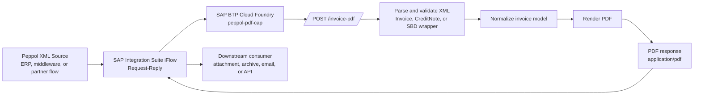

# Peppol PDF CAP

SAP CAP Node.js service that converts Peppol BIS Billing 3.0 UBL `Invoice` and `CreditNote` XML into PDF documents.

The service is intended to be called synchronously from SAP Integration Suite iFlows or any other HTTP client that can post XML and consume a binary PDF response.

## Purpose

This service covers one narrow responsibility:

- receive Peppol billing XML over HTTP
- validate and parse the incoming document
- normalize invoice data into a rendering model
- return a generated PDF in the HTTP response

It is designed as a stateless runtime component and does not require a database, destinations, XSUAA, or browser automation.

## Architecture



The deployed CAP service exposes a single synchronous conversion endpoint. The iFlow posts the Peppol XML payload to `/invoice-pdf`, receives the generated PDF in the HTTP response, and can then attach, store, or forward the PDF to downstream systems.

## Supported Input

The service accepts:

- raw UBL `Invoice` XML
- raw UBL `CreditNote` XML
- `StandardBusinessDocument` containing a nested UBL `Invoice`
- `StandardBusinessDocument` containing a nested UBL `CreditNote`

The service rejects:

- malformed XML
- XML with unsupported root document types
- XML containing DTD or entity declarations

## Service Contract

### Endpoints

```text
GET  /health
POST /invoice-pdf
```

### Health Check

Use the health endpoint for load balancer checks and deployment verification.

Example:

```http
GET /health HTTP/1.1
```

Example response:

```json
{
  "status": "ok",
  "service": "peppol-pdf-cap"
}
```

### PDF Rendering Endpoint

Use `POST /invoice-pdf` for synchronous XML-to-PDF conversion.

Request:

- Method: `POST`
- Path: `/invoice-pdf`
- Content-Type: `application/xml`
- Request body: full Peppol invoice or credit note XML
- Optional header: `X-API-Key`

Successful response:

```text
HTTP/1.1 200 OK
Content-Type: application/pdf
Content-Disposition: inline; filename="<document-id>.pdf"
```

Error response shape:

```json
{
  "error": {
    "code": "bad_request",
    "message": "Invalid XML"
  }
}
```

Typical error statuses:

- `400` for invalid XML or unsupported document structure
- `401` when `PDF_API_KEY` is configured and the request omits or sends the wrong `X-API-Key`
- `413` when the request body exceeds the configured XML size limit
- `500` for unexpected rendering failures

## Runtime Configuration

| Variable | Required | Default | Description |
| --- | --- | --- | --- |
| `PDF_API_KEY` | No | unset | Shared secret for callers. When set, the request must include header `X-API-Key`. |
| `XML_BODY_LIMIT` | No | `5mb` | Maximum accepted XML payload size. |
| `PORT` | No | `4004` | CAP runtime port. |
| `NODE_ENV` | No | environment dependent | Recommended `production` in deployed runtime. |

## Local Development

Before running locally, make sure the environment has:

- Node.js `20`, `21`, or `22`
- npm

Install and run:

```bash
npm install
npm test
npm start
```

Default local URL:

```text
http://localhost:4004
```

## Local Usage

### Invoice Example

```bash
curl -sS -X POST \
  -H "Content-Type: application/xml" \
  --data-binary @test/fixtures/invoice.xml \
  http://localhost:4004/invoice-pdf \
  --output invoice.pdf
```

### Credit Note Example

```bash
curl -sS -X POST \
  -H "Content-Type: application/xml" \
  --data-binary @test/fixtures/credit-note.xml \
  http://localhost:4004/invoice-pdf \
  --output credit-note.pdf
```

### Example With API Key

Start the service:

```bash
PDF_API_KEY=secret npm start
```

Call the endpoint:

```bash
curl -sS -X POST \
  -H "Content-Type: application/xml" \
  -H "X-API-Key: secret" \
  --data-binary @test/fixtures/invoice.xml \
  http://localhost:4004/invoice-pdf \
  --output invoice.pdf
```

## SAP BTP Deployment

This repository supports two Cloud Foundry deployment styles:

- `manifest.yml` for direct `cf push`
- `mta.yaml` for MTA packaging and transport

The runtime is a single Node.js CAP module with no backing services required for the current version.

## Option 1: Direct Cloud Foundry Deployment

Use this when you want the fastest path to a running service.

### 1. Log in to Cloud Foundry

```bash
cf login --sso
cf target -o <org> -s <space>
```

### 2. Push the application

```bash
cf push
```

The included `manifest.yml` configures:

- app name: `peppol-pdf-cap`
- buildpack: `nodejs_buildpack`
- memory: `256M`
- disk quota: `512M`
- command: `npm start`
- `NODE_ENV=production`
- `XML_BODY_LIMIT=5mb`

### 3. Set production environment variables

Set an API key unless the endpoint is intentionally open inside a trusted private landscape.

```bash
cf set-env peppol-pdf-cap PDF_API_KEY "<shared-secret>"
cf set-env peppol-pdf-cap XML_BODY_LIMIT "5mb"
cf restage peppol-pdf-cap
```

### 4. Get the application route

```bash
cf app peppol-pdf-cap
```

Use the reported route as the base URL for callers:

```text
https://<generated-route>/invoice-pdf
```

### 5. Smoke test the deployed app

```bash
curl -sS -X POST \
  -H "Content-Type: application/xml" \
  -H "X-API-Key: <shared-secret>" \
  --data-binary @test/fixtures/invoice.xml \
  https://<generated-route>/invoice-pdf \
  --output invoice.pdf
```

## Option 2: MTA Deployment

Use this when your delivery process requires MTA artifacts.

### 1. Build the MTA archive

```bash
mbt build
```

### 2. Deploy the archive

```bash
cf deploy mta_archives/peppol-pdf-cap_1.0.0.mtar
```

### 3. Set runtime variables and restage

```bash
cf set-env peppol-pdf-cap-srv PDF_API_KEY "<shared-secret>"
cf set-env peppol-pdf-cap-srv XML_BODY_LIMIT "5mb"
cf restage peppol-pdf-cap-srv
```

If your deployed application name differs, use the actual application name shown by `cf apps`.

## SAP Integration Suite iFlow Setup

The recommended integration style is a synchronous Request-Reply call to the CAP app.

### Target Contract

- Method: `POST`
- URL: `https://<btp-route>/invoice-pdf`
- Content-Type: `application/xml`
- Optional security header: `X-API-Key: <PDF_API_KEY>`
- Request body: original Peppol XML message
- Response body: PDF binary

### Recommended iFlow Shape

1. Receive or prepare the Peppol XML message.
2. Keep the message body as the original XML payload.
3. Add a Request-Reply step.
4. Configure an HTTP receiver adapter.
5. Call the CAP route at `/invoice-pdf`.
6. Pass through the PDF response body for storage, attachment handling, or downstream delivery.

### HTTP Receiver Adapter Settings

Use these settings in the receiver channel:

- Address: `https://<btp-route>/invoice-pdf`
- Proxy Type: `Internet`
- Method: `POST`
- Authentication: according to your network design
- Content-Type header: `application/xml`
- Additional header when used: `X-API-Key`

### Message Handling Notes

- Do not transform the XML into JSON before the call.
- Do not wrap the payload in SOAP unless you deliberately add a compatibility layer in front of this service.
- Treat the response as binary content.
- If the caller must retain the original XML and the PDF, store the returned PDF as an attachment or in a subsequent persistence step.

### Example iFlow Call Outcome

Input:

- message body contains a Peppol `Invoice` or `CreditNote`

Output:

- message body contains the generated PDF bytes
- response header `Content-Type` is `application/pdf`

## Security Recommendations

For enterprise use, the minimum recommended baseline is:

- set `PDF_API_KEY`
- expose the application only on routes intended for machine-to-machine traffic
- restrict caller access at network level where possible
- rotate shared secrets through normal operational procedures
- monitor HTTP 4xx and 5xx rates after go-live

If your landscape requires stronger authentication, place the app behind the appropriate BTP security architecture or an API-managed edge and keep this service focused on document conversion.

## Operations

### Health Verification

Use the health endpoint after deployment and during incident triage:

```bash
curl -sS https://<btp-route>/health
```

Expected result:

```json
{
  "status": "ok",
  "service": "peppol-pdf-cap"
}
```

### Logging

For Cloud Foundry runtime logs:

```bash
cf logs peppol-pdf-cap --recent
```

For MTA deployments, use the actual deployed application name if it differs.

### Scaling

Example horizontal scale-out:

```bash
cf scale peppol-pdf-cap -i 2
```

Increase memory if rendering volume or document complexity grows beyond the current `256M` profile.

## Limitations

- the service returns the PDF directly and does not persist documents
- the service currently uses a shared-secret model when `PDF_API_KEY` is enabled
- invalid XML bytes before the XML declaration are rejected
- the service is intentionally narrow and does not implement broader invoice workflow logic

## Development and Test

Run the automated tests:

```bash
npm test
```

Run the test watcher during active development:

```bash
npm run test:watch
```
